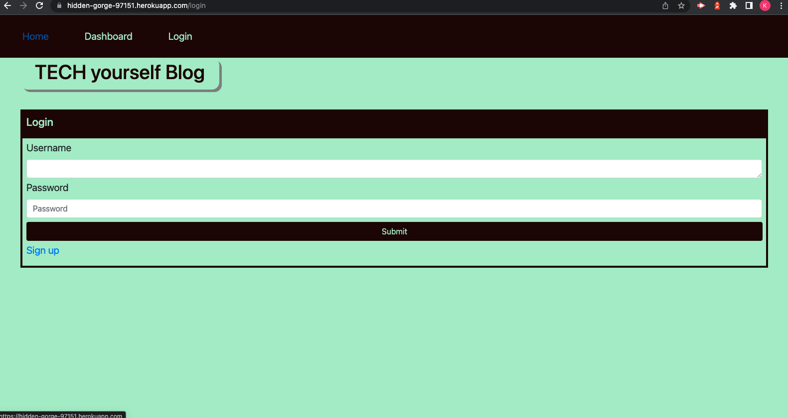

# youbetterTECHyourself-BLOG

[](https://opensource.org/licenses/MIT)



This tech blog allows users to login, create, edit, delete and comment on their own posts.

## Description

## Table of Contents

* [Built With
  ](#builtwith)

* [Installation
  ](#installation)  

* [Usage
  ](#usage)
  
* [Deployed
  ](#deployed)

## Built With

* [Express Handlebars](https://www.npmjs.com/package/express-handlebars)
* [MySQL2](https://www.npmjs.com/package/mysql2)
* [Sequelize](https://www.npmjs.com/package/sequelize)

## Installation

To install necessary dependencies, run the following command:

```
npm i 
```

## Usage

First, you will need to create an account and sign up. Once you have done that, proceed to the log in screen to access your account. You will then be able post, comment on posts and will be able to see their posts once they access the dashboard. From the dashboard, you will be able to edit and/or delete their posts.

## Deployed

My tech blog can be found at: https://github.com/kylejames20/youbetterTECHyourself-BLOG

You can view the deployed public version at: https://hidden-gorge-97151.herokuapp.com/login